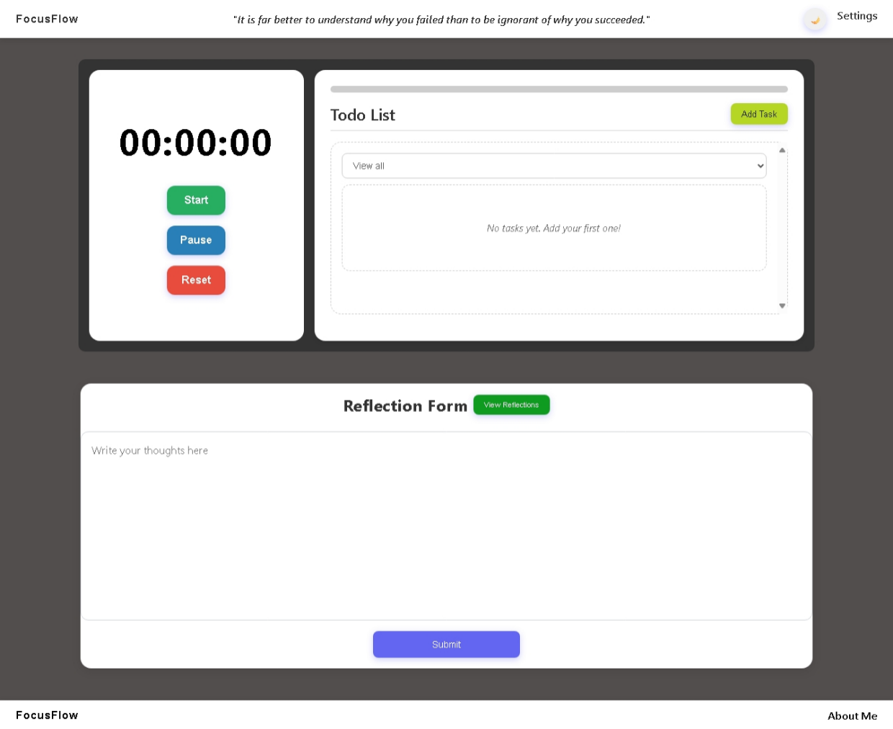

# FocusFlow

A productivity Dashboard that contains a timer/stopwatch, Todo List, and a Journal in a single page.



### Prerequisites

Please setup a react on your terminal by typing...

```bash
npm create vite@latest frontend
```

## Technologies 
* [React](https://reactjs.org/) - UI Library.

## Documentation

To know more about the documentation of my project, you can check my [Linkedin](https://www.linkedin.com/in/psalm-muelvin-lopez-003a78227/) profile.